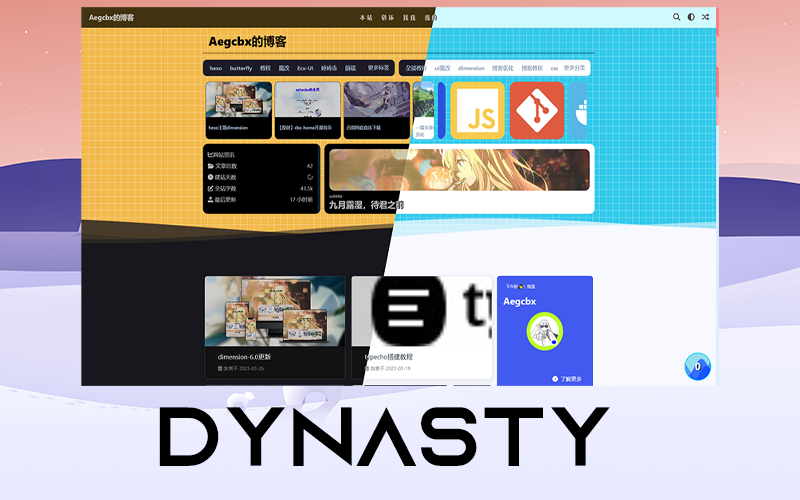

# hexo-theme-Dynasty

[English](./README.md)
| [简体中文](./README.zh-Hans.md)


## 预览

点击图片前往预览站点：

[](https://uu.sssu.us/)

## 安装

### 环境

- [Node.js `18.17.x` 以上](https://nodejs.org/zh-cn/)
- 推荐使用 [pnpm](https://pnpm.io/zh/) 包管理器
- [最新版 Hexo](https://hexo.io/zh-cn/)

### 使用 `hexo-cli` 新建博客项目：

```shell script
hexo init Hexo --no-install
cd Hexo
pnpm i
git clone https://github.com/Yue-plus/hexo-theme-arknights.git themes/arknights
```

### 安装依赖包

删除默认的 marked 渲染器（使用 [kramed 渲染器](https://github.com/sun11/hexo-renderer-kramed)）代替：

```shell script
pnpm un hexo-renderer-marked
```

安装所有依赖包：

```shell script
pnpm i hexo-wordcount hexo-renderer-pug hexo-renderer-stylus hexo-renderer-kramed hexo-generator-search is-promise object-assign pangu yamljs --save
```

## 社区

<a target="_blank" href="https://qm.qq.com/cgi-bin/qm/qr?k=boea2LYMrf08sg8v7S8AtujkoL0iDyP3&jump_from=webapi&authKey=dW6WNBsGWkdTHokpRIoa9gUO/ja2HcOwNiXvTAPk7yIrN4Jxg0vifDSgcwqJWQPF"></a>